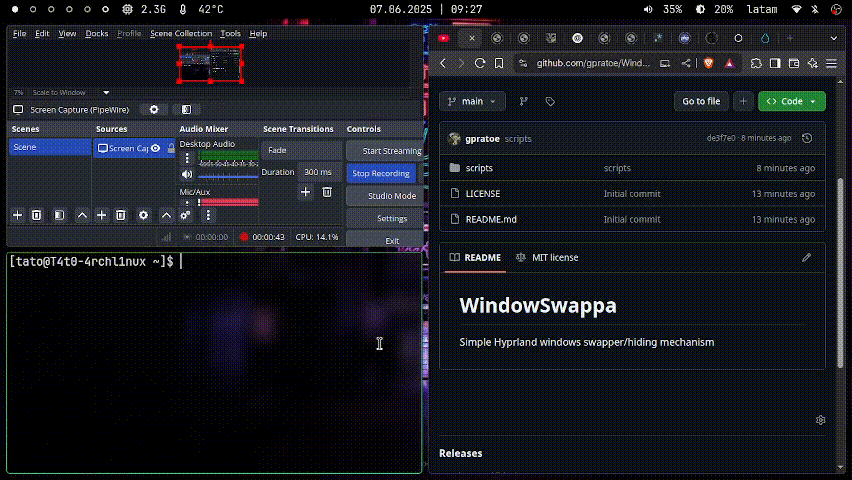

# WindowSwappa
A simple Hyprland window swapping/hiding mechanism.

___




## Dependencies

- rofi

## Installation

1. Clone the repo
2. `cd WindowSwappa`
3. `cp scripts/* ~/.config/hypr/scripts/`
4. Add binds to `~/.config/hypr/hyprland.conf`:

  ``` bash
  # windowswappa
  bind = $mainMod, A, exec, ~/.config/hypr/scripts/windowswappa_add.sh
  bind = $mainMod, Bar, exec, ~/.config/hypr/scripts/windowswappa_next.sh -N
  bind = $mainMod SHIFT, Bar, exec, ~/.config/hypr/scripts/windowswappa_next.sh
  bind = $mainMod, D, exec, ~/.config/hypr/scripts/windowswappa_select.sh
  bind = $mainMod, X, exec, ~/.config/hypr/scripts/windowswappa_select.sh -S
  ```

## Usage

- `$mainMod + A` to stash (hide) a window
- `$mainMod + |` to swap the active window with a stashed one (cyclically).
- `$mainMod + SHIFT + |` to toggle back and forth with the last window.
- `$mainMod + D` to detach a stashed window.
- `$mainMod + X` to select a specific window to swap in.

## Notes

This doesn’t truly “hide” windows — it simply moves them to the 10th workspace. That was enough for my use case, but if you want a different behavior, the scripts are easy to tweak.

It’s also not workspace-specific: if you stash a window in `workspace 1`, you can retrieve it in `workspace 2`, and so on. If you want it to be workspace-specific, adding a few lines to the scripts should be enough — they’re simple and easy to understand.


